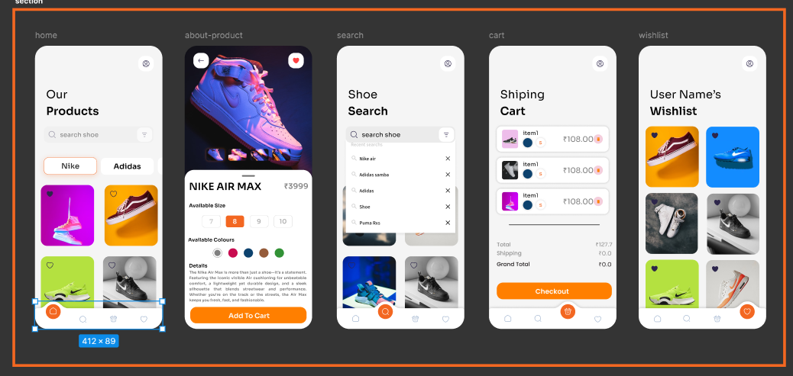

<<<<<<< HEAD
# Shoezy-ecome-for-shoe
Shoezy is a sleek and modern e-commerce mobile app built using Flutter, tailored for premium sneaker shopping. The app features a minimal UI inspired by clean design principles, allowing users to browse, view details, and add shoes to their cart effortlessly. It includes responsive layout, smooth navigation, Hero animations, and a size selection ui
=======
# Shoe Shopping App

A Flutter application that replicates a modern shoe shopping interface with clean design and smooth interactions.

## Features

- Modern UI design with custom styling
- Interactive brand selection chips
- Product grid with favorite functionality
- Custom bottom navigation with special home button
- Responsive design for mobile devices

## Getting Started

### Prerequisites

- Flutter SDK (3.0.0 or higher)
- Dart SDK
- Android Studio / VS Code with Flutter extensions
- iOS development tools (for iOS deployment)

### Installation

1. Clone the repository or extract the project files
2. Navigate to the project directory
3. Install dependencies:
   ```bash
   flutter pub get
   ```

### Running the App

To run the app in debug mode:

```bash
flutter run
```

To build for release:

```bash
# Android
flutter build apk

# iOS
flutter build ios
```

## Project Structure

```
lib/
├── main.dart                 # App entry point
├── screens/
│   └── home_screen.dart     # Main home screen
└── widgets/
    ├── brand_chip.dart      # Brand selection chips
    ├── product_card.dart    # Product display cards
    └── bottom_navigation.dart # Custom bottom navigation
```

## Customization

### Colors
The app uses a custom color scheme defined in the theme. The primary orange color is `#F36721`.

### Fonts
The app uses the Sora font family. Make sure to add the font files to the `assets/fonts/` directory.

### Images
Product images should be placed in the `assets/images/` directory and referenced in the products list.

## Dependencies

- `flutter`: The Flutter framework
- `cupertino_icons`: iOS-style icons

## Contributing

1. Fork the project
2. Create your feature branch
3. Commit your changes
4. Push to the branch
5. Open a Pull Request
>>>>>>> faf4834 (Initial commit for Shoezy app)
## Screenshots

| Home Screen | Product Grid |
|-------------|--------------|
|  |  |

